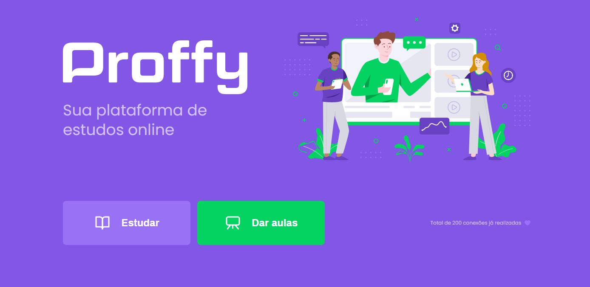

 <h1 align="center">
    
</h1>

<h2 align="center"> 
	Proffy
</h2>

<p align="center">
 <a href="#-sobre-o-projeto">Sobre</a> •
 <a href="#dependências">Dependências</a> •
 <a href="#-como-executar-o-projeto">Como executar</a> • 
 <a href="#-tecnologias">Tecnologias</a> • 
 <a href="#-autor">Autor</a> • 
 <a href="#user-content--licença">Licença</a>
</p>

---

## 💻 Sobre o projeto

 Proffy é uma plataforma onde professores podem se cadastrar para dar aulas e alunos podem contratar os professores para dar aulas
 sobre diversas áreas e em diferentes horários.


Projeto desenvolvido durante a **NLW - Next Level Week** oferecida pela [Rocketseat](https://blog.rocketseat.com.br).
O NLW é uma experiência online com muito conteúdo prático, desafios e hacks onde o conteúdo fica disponível durante uma semana.

## Dependências

    Antes de começar, você vai precisar ter instalado em sua máquina as seguintes ferramentas:
    [Git](https://git-scm.com), [Node.js](https://nodejs.org/en/). 
    Além disto é bom ter um editor para trabalhar com o código como [VSCode](https://code.visualstudio.com/)

    ```bash
    # Instale as dependências
    $ npm install

    ```

---

## 🚀 Como executar o projeto

```bash
# Na pasta do projeto iniciar o terminal e executar o comando:
 npm run dev

# o Site estará disponível em:
 http://localhost:5500/

```
---

## 🛠 Tecnologias

As seguintes ferramentas foram usadas na construção do projeto:

-   **[Node](https://nodejs.org/en/)**
-   **[Express](https://expressjs.com/)**
-   **[Nodemon](https://nodemon.io/)**
-   **[Nunjucks](https://mozilla.github.io/nunjucks/)**
-   **[sqlite-async](https://www.npmjs.com/package/sqlite-async)**

---

## 🦸 Autor


 
 <br />
 <sub><b>Felipe Nunes</b></sub>
 <br />

[](https://www.linkedin.com/in/felipenno/) 
[](mailto:felipenno14@gmail.com)

---

## 📝 Licença

Este projeto esta sobe a licença [MIT](./LICENSE).


